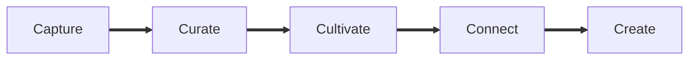

- [Cultivating and Connecting Using Modular Notes and Personal Memos](https://link.dendron.so/6tho)

> Credit to `foureyedsoul#0796` from the Dendron community for sharing this link, as I added it to my reading list for this week's reading series!

There are a variety of articles, guidance, and methods that exist when it comes to note taking workflows. This article focused on short memos (~200 words) as a way to expand their [existing approach to a _Creativity Flywheel_](https://thesweetsetup.com/a-professionals-approach-to-the-creativity-flywheel/).

> "...If you imagine a gardener who tills the soil in a flowerbed and apply that to tilling and pruning your notes and captured information, you’re on the right track."

Sounds like dendronites working on their gardens.

My favorite thoughts from this article are around being able to use your garden to see the connections and solutions to problems you may have been unable to see before. This makes me think of connections being like a large, underground root system. Or, perhaps more like the [giant mushroom that's the largest organism known on Earth](https://www.discovery.com/nature/Giant-Mushroom-Largest-Organism-Ever).

## Related

- [Atomic notes: How to use Zettelkasten to boost your creativity and productivity](https://zapier.com/blog/zettelkasten-method/)
- Conversations around workflows and note taking strategies happen across a variety of the Dendron [[Discord Channels in the Community category|community.discord.channels#community]].
- Dendron's [Open PKM Catalog](https://pkm.dendron.so/): a reference of all things PKM (Personal knowledge management)! Feel free to browse and contribute.