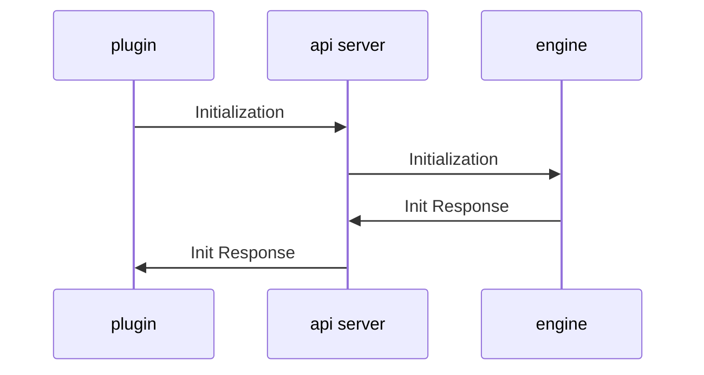

## Overview

Dendron is composed of three main components and a collection of complementing libraries.

Below is an example of the initialization process

Dendron has a [[CLI|dendron.topic.cli]] that executes the above workflow as well, except replace `plugin` with `cli`. The difference is that the CLI will tear down the server and engine after the command has completed whereas for the plugin, the server and engine run as long as the workspace is active.

Note that you can run just the server by itself using the [[launchEngineServer|dendron.topic.cli#launchengineserver]] command.

## Major Components

### Dendron Plugin
- name: @dendronhq/plugin-core
- [repo](https://github.com/dendronhq/dendron/tree/master/packages/plugin-core)

This is the Dendron VSCode extension

### Dendron Engine
- name: @dendronhq/engine-server
- [repo](https://github.com/dendronhq/dendron/tree/master/packages/engine-server)

This is responsible for Dendron's hierarchal index and lookup capabilities. It also contains Dendron specific markdown parsers. While the name says `server`, there is no server that comes with the engine

### Dendron API Server
- name: @dendronhq/api-server
- [repo](https://github.com/dendronhq/dendron/tree/master/packages/api-server)

This package contains the express server implementation for Dendron. It provides a REST based shim to allow the Dendron plugin to talk to the engine.

## Other Components
### Dendron Common All
- name: @dendronhq/common-all
- [repo](https://github.com/dendronhq/dendron/tree/master/packages/common-all)

This is a bunch of types and utilities that is consumed by multiple Dendron dependencies

### Dendron Common Server

- name: @dendronhq/common-server
- [repo](https://github.com/dendronhq/dendron/tree/master/packages/common-server)

This is common utilities that are used by server-side versions of Dendron (currently, this is the only available built of Dendron - in the future, the plan is to have a browser only client)

### Dendron CLI

- name: @dendronhq/dendron-cli
- [repo](https://github.com/dendronhq/dendron/tree/master/packages/dendron-cli)

This package lets you access Dendron via CLI. 

## Next
- You can see the full list of projects as well as detailed documentation [[here|pro]]
