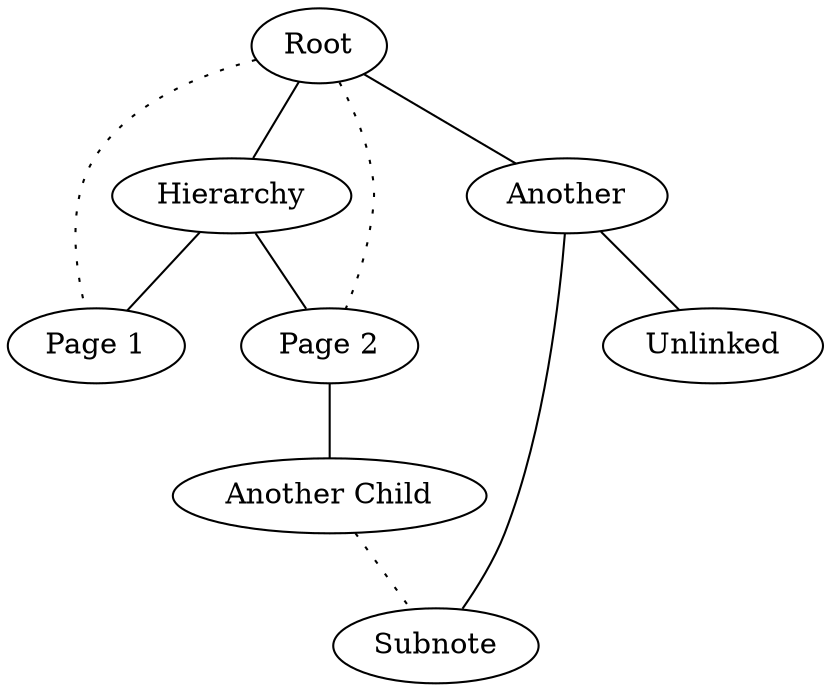

## Summary

The GraphViz export pod will take Dendron markdown and convert it into a graph structured using DOT Language. The export config some additional options for filtering the graph output by the type of note connection.

In the graph output, hierarchical connections are notated with a solid line and edge connections are notated with a dotted line.

### Config Options
- `showGraphByHierarchy`: Include hierarchical note connections (e.g. parent → child connections)
  - default: `true`
- `showGraphByEdges`: Include edge (linked note) relationships, e.g. note with `[[link]]` → another note
  - default: `false`

If both `showGraphByHierarchy` and `showGraphByEdges` are true, the graph will include both hierarchical and edge (linked note) connections in the output. Hierarchical connections will be prioritized over edge connections.

### Example Output
#### `graphviz.dot` File
```
graph {
  note_31905b7bc7c0471aaea0dded017a1ba7 [label="Root"];
  note_31905b7bc7c0471aaea0dded017a1ba7 -- note_999edea9da7f4543ba082039e91887e8 [style=dotted];
  note_31905b7bc7c0471aaea0dded017a1ba7 -- note_bd6a767437fa4970a3ebc9c7b04ee660 [style=dotted];
  note_dc9ff513551442b8a4cf5d2836536d46 [label="Another"];
  note_31905b7bc7c0471aaea0dded017a1ba7 -- note_dc9ff513551442b8a4cf5d2836536d46;
  note_517fc4c57e4a407d892f8781fa6881f4 [label="Hierarchy"];
  note_31905b7bc7c0471aaea0dded017a1ba7 -- note_517fc4c57e4a407d892f8781fa6881f4;
  note_0bd30ff9594f48f5bc0139a71fe6795e [label="Subnote"];
  note_dc9ff513551442b8a4cf5d2836536d46 -- note_0bd30ff9594f48f5bc0139a71fe6795e;
  note_965bfe1569c348329e054d95404c2b84 [label="Unlinked"];
  note_dc9ff513551442b8a4cf5d2836536d46 -- note_965bfe1569c348329e054d95404c2b84;
  note_999edea9da7f4543ba082039e91887e8 [label="Page 1"];
  note_517fc4c57e4a407d892f8781fa6881f4 -- note_999edea9da7f4543ba082039e91887e8;
  note_bd6a767437fa4970a3ebc9c7b04ee660 [label="Page 2"];
  note_517fc4c57e4a407d892f8781fa6881f4 -- note_bd6a767437fa4970a3ebc9c7b04ee660;
  note_bf13ac2ecc16481fb1a15e25fd32e5c1 [label="Another Child"];
  note_bd6a767437fa4970a3ebc9c7b04ee660 -- note_bf13ac2ecc16481fb1a15e25fd32e5c1;
  note_bf13ac2ecc16481fb1a15e25fd32e5c1 -- note_0bd30ff9594f48f5bc0139a71fe6795e [style=dotted];
}
```
#### Rendered Graph
