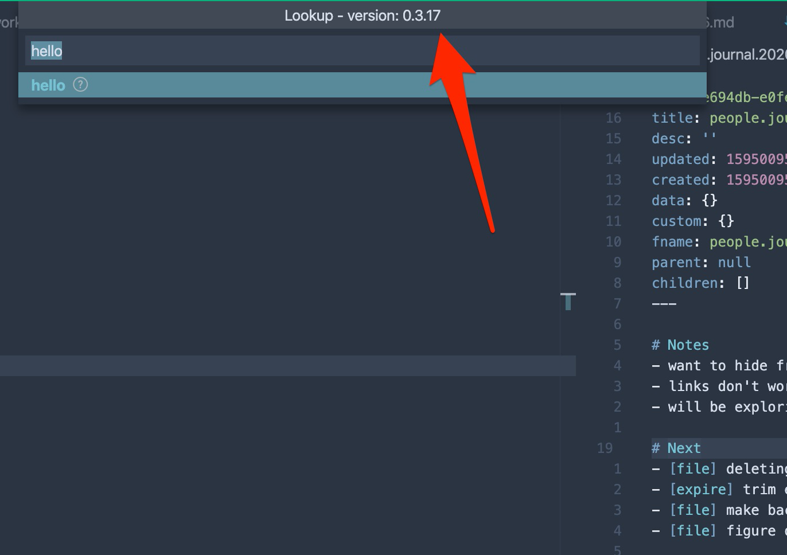

# Upgrading

VSCode auto updates outdated extensions periodically but if you want to trigger it manually, you can click the extensions tab and look for dendron. If there's an update available, it will be done at this point.

<a href="https://www.loom.com/share/796a10cab7204733877e7f708b6aaaca"> 
17 July, 2020 - Loom Recording - Watch Video
  </a>

To check what version of dendron you're on, you can open the lookup bar and look for the version number in the title. 

