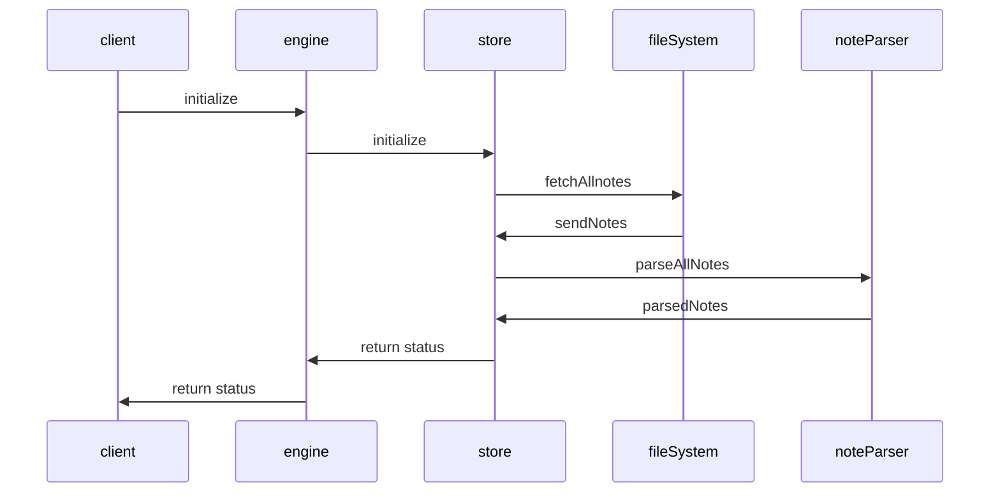

## Initialization

Dendron initialization process

- [Video walkthrough](https://youtu.be/nWJCP1DR5Io)

## Indexing
For indexing, would use [fusejs](https://fusejs.io/) - this is the same indexing mechanism as we do for lookup. 

Some incomplete pseudo code on how lookup indexes here: [[queryNotes|pkg.dendron-engine.internal.lookup#querynotes]]

FuseEngine is initialized here: https://github.com/dendronhq/dendron/blob/dev/packages/engine-server/src/enginev2.ts#L88:L88

Code where we specify fields to index [here](https://github.com/dendronhq/dendron/blob/dev/packages/engine-server/src/fuseEngine.ts#L110:L110)

## Refreshing Notes

When a note changes on disk, we use a [fileWatcher](https://github.com/dendronhq/dendron/blob/dev/packages/plugin-core/src/fileWatcher.ts#L65:L65) to keep track of changes and we call [updateNote](https://github.com/dendronhq/dendron/blob/dev/packages/engine-server/src/engineClient.ts#L348:L348) to update the version of the note we have in the engine

## Related
- [[Dendron Startup|pkg.dendron-engine.internal.startup]]
