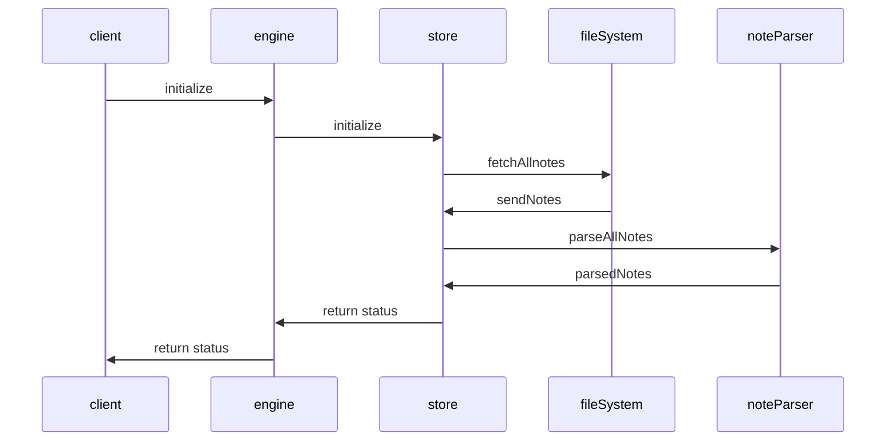

## Initialization

Dendron initialization process



- [Video walkthrough](https://youtu.be/nWJCP1DR5Io)

## Modules

The Dendron Engine is organized into modules that are a top level folder

```
- src/  
    - metadata/
        - service.ts
        - index.ts
        - ...
    - migration/
        - service.ts
        - index.ts
        - ...
```

## Related
- [[Dendron Startup|pkg.dendron-engine.internal.startup]]
- [[Lookup|pkg.dendron-engine.t.lookup]]
