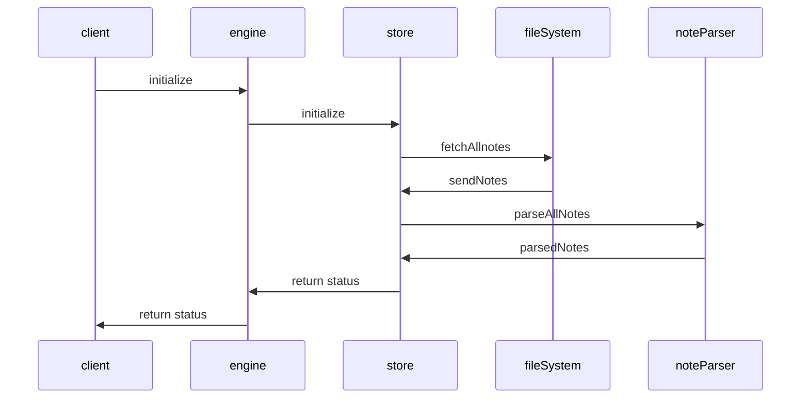

## Initialization

Dendron initialization process

- [Video walkthrough](https://youtu.be/nWJCP1DR5Io)

## Related
- [[Dendron Startup|pkg.dendron-engine.internal.startup]]
- [[Lookup|pkg.dendron-engine.t.lookup]]
