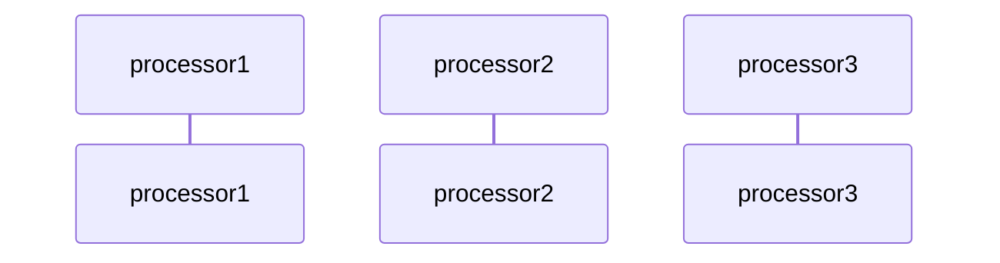

## Summary

Markdown toolchain for Dendron

## Limitations
- we use "unified": "^9.1.0" (this is not the latest version of unified)

## Lookup
- [syntax-tree/unist](https://github.com/syntax-tree/unist#unist-utilities)
- [syntax-tree/mdast](https://github.com/syntax-tree/mdast#list-of-utilities)
- [remarkjs/remark](https://github.com/remarkjs/remark/blob/main/doc/plugins.md)

## Details
- See [walthrough](https://youtu.be/uEOnZiZaiCc) of the code 
- NOTE: we are using `unified 9.X`. this is incomaptible with `unified 10.X` plugins

## Unified
- unified
	- remark: parse/compile markdown
		- mdast
			- https://github.com/syntax-tree/mdast
	- rehype: parse/compile html

- processor
	- parser(text): AST
	- compiler(ast): text
	- transformer(ast): AST
	- data(key, value)
- methods
	- parse -> parse
	- process()
		- parse -> transform -> compile
	- processSync()
	- toString -> compile

## Dendron
- dest:
	- DENDRON_MD: identiy transformation
	- REGULAR_MD: regular markdown
	- PREVIEW_ENHANCED: hack for preview
	- HTML: for publishing, make transformations in HTML
