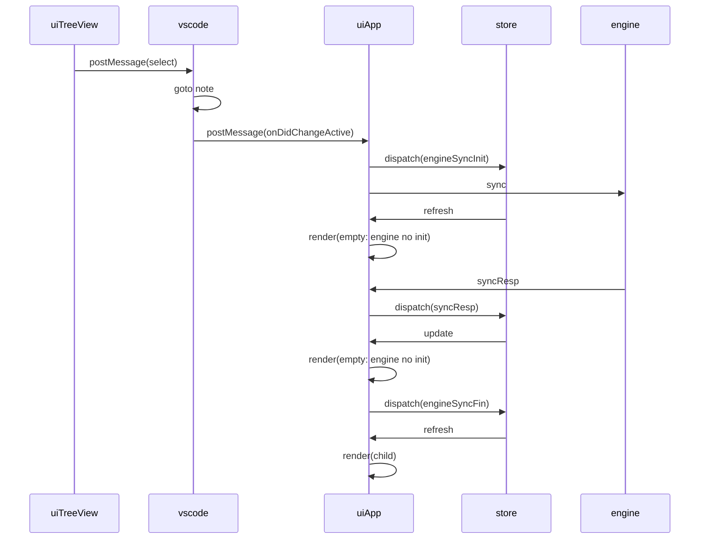

### onClick



```

VM11:5 got message 
MessageEvent {isTrusted: true, data: {…}, origin: "vscode-webview://webviewview-dendron-treeviewv2", lastEventId: "", source: Window, …}
VM11:12 got message from vscode 
{type: "onDidChangeActiveTextEditor", data: {…}, source: "vscode"}

ConsoleLogger.js?09b0:100 [INFO] 01:46.330 AppVSCode {ctx: "useVSCodeMsg", msg: {…}, query: {…}}
ConsoleLogger.js?09b0:100 [INFO] 01:46.330 AppVSCode {ctx: "useVSCodeMsg", msg: "syncEngine:pre", port: "3005", ws: "/Users/kevinlin/projects/dendronv2/dendron/packages/dendron-11ty/fixtures/test-workspace"}
ConsoleLogger.js?09b0:100 [INFO] 01:46.332 engineSlice {state: "start:initNotes", requestId: "cUNaiDbR8t2yKE5Nb2a8U"}

ConsoleLogger.js?09b0:100 [INFO] 01:46.333 AppVSCode {state: "enter", query: {…}}
ConsoleLogger.js?09b0:100 [INFO] 01:46.334 AppVSCode {ctx: "exit", state: "engine:notInitialized"}

ConsoleLogger.js?09b0:100 [INFO] 01:46.341 initNotesThunk {state: "enter", endpoint: "http://localhost:3005", port: 3005, ws: "/Users/kevinlin/projects/dendronv2/dendron/packages/dendron-11ty/fixtures/test-workspace"}
ConsoleLogger.js?09b0:100 [INFO] 01:46.342 initNotesThunk {state: "pre:workspaceSync"}
ConsoleLogger.js?09b0:100 [INFO] 01:46.347 useEngine {ctx: "useEffect", state: "enter"}
ConsoleLogger.js?09b0:100 [INFO] 01:46.347 useEngine {ctx: "useEffect", state: "exit", engineState: {…}}
ConsoleLogger.js?09b0:100 [INFO] 01:46.356 initNotesThunk {state: "post:workspaceSync"}
ConsoleLogger.js?09b0:100 [INFO] 01:46.356 initNotesThunk {state: "pre:setNotes"}

ConsoleLogger.js?09b0:100 [INFO] 01:46.362 AppVSCode {state: "enter", query: {…}}
ConsoleLogger.js?09b0:100 [INFO] 01:46.363 AppVSCode {ctx: "enter", query: {…}}
ConsoleLogger.js?09b0:100 [INFO] 01:46.363 AppVSCode {ctx: "exit", state: "engine:notInitialized"}

ConsoleLogger.js?09b0:100 [INFO] 01:46.364 initNotesThunk {state: "post:setNotes"}
ConsoleLogger.js?09b0:100 [INFO] 01:46.365 engineSlice {state: "fin:initNotes", requestId: "cUNaiDbR8t2yKE5Nb2a8U"}

ConsoleLogger.js?09b0:100 [INFO] 01:46.366 AppVSCode {state: "enter", query: {…}}
ConsoleLogger.js?09b0:100 [INFO] 01:46.366 AppVSCode {ctx: "enter", query: {…}}
ConsoleLogger.js?09b0:100 [INFO] 01:46.367 AppVSCode {ctx: "exit", state: "render:child"}

ConsoleLogger.js?09b0:100 [INFO] 01:46.367 treeViewContainer {ctx: "TreeViewContainer", state: "enter", engine: {…}, ide: {…}}
ConsoleLogger.js?09b0:100 [INFO] 01:46.367 treeViewContainer {ctx: "TreeViewContainer", state: "exit"}
ConsoleLogger.js?09b0:100 [INFO] 01:46.377 useEngine {ctx: "useEffect", state: "enter"}
ConsoleLogger.js?09b0:100 [INFO] 01:46.377 useEngine {ctx: "useEffect", state: "exit", engineState: {…}}

ConsoleLogger.js?09b0:100 [INFO] 01:46.379 AppVSCode {ctx: "useVSCodeMsg", msg: "syncEngine:post"}

ConsoleLogger.js?09b0:100 [INFO] 01:46.380 AppVSCode {state: "enter", query: {…}}
ConsoleLogger.js?09b0:100 [INFO] 01:46.381 AppVSCode {ctx: "enter", query: {…}}
ConsoleLogger.js?09b0:100 [INFO] 01:46.381 AppVSCode {ctx: "exit", state: "render:child"}

ConsoleLogger.js?09b0:100 [INFO] 01:46.381 treeViewContainer {ctx: "TreeViewContainer", state: "enter", engine: {…}, ide: {…}}
ConsoleLogger.js?09b0:100 [INFO] 01:46.382 treeViewContainer {ctx: "TreeViewContainer", state: "exit"}

ConsoleLogger.js?09b0:100 [INFO] 01:46.385 AppVSCode {ctx: "useVSCodeMsg", msg: "setNote:post"}
ConsoleLogger.js?09b0:100 [INFO] 01:46.387 treeViewContainer {ctx: "TreeViewContainer", state: "useEffect:preCalculateTree"}
ConsoleLogger.js?09b0:100 [INFO] 01:46.387 treeViewContainer {ctx: "TreeViewContainer", state: "useEffect:postCalculateTree", activeNoteIds: Array(0)}

ConsoleLogger.js?09b0:100 [INFO] 01:46.388 treeViewContainer {ctx: "TreeViewContainer", state: "enter", engine: {…}, ide: {…}}
ConsoleLogger.js?09b0:100 [INFO] 01:46.388 treeViewContainer {ctx: "TreeViewContainer", state: "exit"}

​

```
