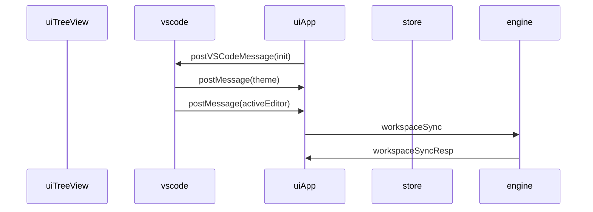

[INFO] 39:06.801 useEngine {ctx: "useEffect", state: "enter"}
ConsoleLogger.js?09b0:100 [INFO] 39:06.801 useEngine {msg: "dispatch notes", force: undefined}
VM12:24 got message MessageEvent {isTrusted: true, data: {…}, origin: "http://localhost:3000", lastEventId: "", source: global, …}
VM12:29 initilizing client
ConsoleLogger.js?09b0:100 [INFO] 39:07.61 AppVSCode {ctx: "useVSCodeMsg", msg: {…}, query: {…}}
ConsoleLogger.js?09b0:100 [INFO] 39:07.61 AppVSCode {ctx: "useVSCodeMsg", theme: "dark", msg: "theme"}
ConsoleLogger.js?09b0:100 [INFO] 39:07.62 AppVSCode {state: "enter!", query: {…}}
ConsoleLogger.js?09b0:100 [INFO] 39:07.63 AppVSCode {ctx: "exit", state: "router:notInitialized"}
ConsoleLogger.js?09b0:100 [INFO] 39:07.92 AppVSCode {state: "enter!", query: {…}}
ConsoleLogger.js?09b0:100 [INFO] 39:07.92 AppVSCode {ctx: "exit", state: "render:child", engine: {…}, ide: {…}}

ConsoleLogger.js?09b0:100 [INFO] 39:07.93 treeViewContainer {ctx: "TreeViewContainer", state: "enter", engine: {…}, ide: {…}}
ConsoleLogger.js?09b0:100 [INFO] 39:07.93 treeViewContainer {ctx: "TreeViewContainer", state: "exit:engineNoInit"}

ConsoleLogger.js?09b0:100 [INFO] 39:07.98 useEngine {ctx: "useEffect", state: "enter"}
ConsoleLogger.js?09b0:100 [INFO] 39:07.98 useEngine {msg: "dispatch notes", force: undefined}
ConsoleLogger.js?09b0:100 [INFO] 39:07.99 useEngine {ctx: "useEffect", state: "initEngine"}
ConsoleLogger.js?09b0:100 [INFO] 39:07.99 engineSlice {state: "start:initNotes", requestId: "WA3dCT53MiUxQEVcn7GNN"}
ConsoleLogger.js?09b0:100 [INFO] 39:07.100 initNotesThunk {state: "enter", endpoint: "http://localhost:3005", port: 3005, ws: "/home/kevinlin/workspace/dendron/test-workspace"}
ConsoleLogger.js?09b0:100 [INFO] 39:07.101 initNotesThunk {state: "pre:workspaceSync"}
ConsoleLogger.js?09b0:100 [INFO] 39:07.102 useEngine {ctx: "useEffect", state: "exit", engineState: {…}}

ConsoleLogger.js?09b0:100 [INFO] 39:07.103 AppVSCode {state: "enter!", query: {…}}
ConsoleLogger.js?09b0:100 [INFO] 39:07.103 AppVSCode {ctx: "exit", state: "render:child", engine: {…}, ide: {…}}
ConsoleLogger.js?09b0:100 [INFO] 39:07.104 treeViewContainer {state: "areEqual", isDiff: false, prevProps: {…}, nextProps: {…}}

ConsoleLogger.js?09b0:100 [INFO] 39:07.107 useEngine {ctx: "useEffect", state: "enter"}
ConsoleLogger.js?09b0:100 [INFO] 39:07.107 useEngine {ctx: "useEffect", state: "exit", engineState: {…}}
ConsoleLogger.js?09b0:100 [INFO] 39:07.375 initNotesThunk {state: "post:workspaceSync"}
ConsoleLogger.js?09b0:100 [INFO] 39:07.375 initNotesThunk {state: "pre:setNotes"}
ConsoleLogger.js?09b0:100 [INFO] 39:07.380 AppVSCode {state: "enter!", query: {…}}
ConsoleLogger.js?09b0:100 [INFO] 39:07.380 AppVSCode {ctx: "exit", state: "render:child", engine: {…}, ide: {…}}
ConsoleLogger.js?09b0:100 [INFO] 39:07.381 treeViewContainer {state: "areEqual", isDiff: true, prevProps: {…}, nextProps: {…}}
ConsoleLogger.js?09b0:100 [INFO] 39:07.381 treeViewContainer {ctx: "TreeViewContainer", state: "enter", engine: {…}, ide: {…}}
ConsoleLogger.js?09b0:100 [INFO] 39:07.381 treeViewContainer {ctx: "TreeViewContainer", state: "exit:engineNoInit"}
ConsoleLogger.js?09b0:100 [INFO] 39:07.385 initNotesThunk {state: "post:setNotes"}
ConsoleLogger.js?09b0:100 [INFO] 39:07.388 engineSlice {state: "fin:initNotes", requestId: "WA3dCT53MiUxQEVcn7GNN"}

ConsoleLogger.js?09b0:100 [INFO] 39:07.389 AppVSCode {state: "enter!", query: {…}}
ConsoleLogger.js?09b0:100 [INFO] 39:07.389 AppVSCode {ctx: "exit", state: "render:child", engine: {…}, ide: {…}}
ConsoleLogger.js?09b0:100 [INFO] 39:07.389 treeViewContainer {state: "areEqual", isDiff: true, prevProps: {…}, nextProps: {…}}
ConsoleLogger.js?09b0:100 [INFO] 39:07.390 treeViewContainer {ctx: "TreeViewContainer", state: "enter", engine: {…}, ide: {…}}
ConsoleLogger.js?09b0:100 [INFO] 39:07.391 treeViewContainer {ctx: "TreeViewContainer", state: "setViewReady"}
react-dom.development.js?24d1:67 Warning: Cannot update a component (`AppVSCode`) while rendering a different component (`TreeViewParent`). To locate the bad setState() call inside `TreeViewParent`, follow the stack trace as described in https://reactjs.org/link/setstate-in-render
    at TreeViewParent (webpack-internal:///./pages/vscode/tree-view.tsx:134:22)
    at ThemeSwitcherProvider (webpack-internal:///../../node_modules/react-css-theme-switcher/dist/react-css-theme-switcher.esm.js:79:23)
    at AppVSCode (webpack-internal:///./pages/_app.tsx:51:24)
    at Provider (webpack-internal:///../../node_modules/react-redux/es/components/Provider.js:16:20)
    at App (webpack-internal:///./pages/_app.tsx:222:25)
    at ErrorBoundary (webpack-internal:///../../node_modules/@next/react-dev-overlay/lib/internal/ErrorBoundary.js:23:47)
    at ReactDevOverlay (webpack-internal:///../../node_modules/@next/react-dev-overlay/lib/internal/ReactDevOverlay.js:73:23)
    at Container (webpack-internal:///../../node_modules/next/dist/client/index.js:154:5)
    at AppContainer (webpack-internal:///../../node_modules/next/dist/client/index.js:642:24)
    at Root (webpack-internal:///../../node_modules/next/dist/client/index.js:778:25)
ConsoleLogger.js?09b0:100 [INFO] 39:07.397 treeViewContainer {ctx: "TreeViewContainer", state: "exit"}

ConsoleLogger.js?09b0:100 [INFO] 39:07.412 useEngine {ctx: "useEffect", state: "enter"}
ConsoleLogger.js?09b0:100 [INFO] 39:07.412 useEngine {ctx: "useEffect", state: "exit", engineState: {…}}
ConsoleLogger.js?09b0:100 [INFO] 39:07.413 AppVSCode {state: "enter!", query: {…}}
ConsoleLogger.js?09b0:100 [INFO] 39:07.413 AppVSCode {ctx: "exit", state: "render:child", engine: {…}, ide: {…}}
ConsoleLogger.js?09b0:100 [INFO] 39:07.413 treeViewContainer {state: "areEqual", isDiff: false, prevProps: {…}, nextProps: {…}}

VM12:24 got message MessageEvent {isTrusted: true, data: {…}, origin: "http://localhost:3000", lastEventId: "", source: global, …}
VM12:44 got webclient event {source: "webClient", type: "onReady", data: {…}}
