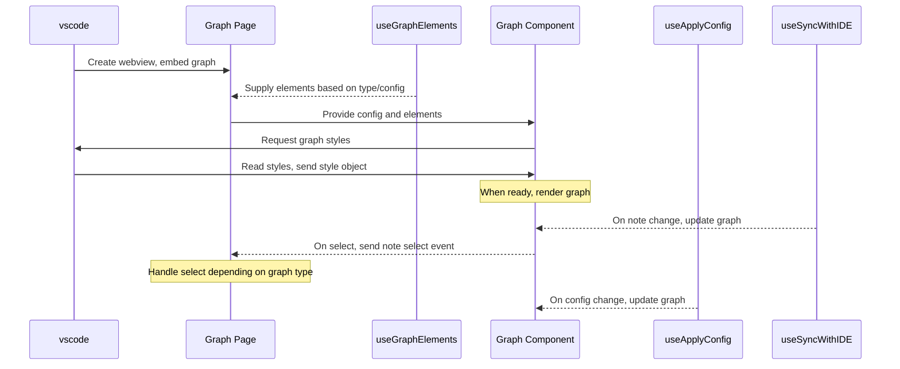

## Graph Lifecycle

```mermaid
sequenceDiagram
    participant vscode
    participant GP as Graph Page
    participant useGraphElements
    participant GC as Graph Component
    participant useApplyConfig
    participant useSyncWithIDE


    vscode->>GP: Create webview, embed graph
    useGraphElements-->>GP: Supply elements based on type/config
    GP->>GC: Provide config and elements
    GC->>vscode: Request graph styles
    vscode->>GC: Read styles, send style object
    Note over GC: When ready, render graph
    useSyncWithIDE-->>GC: On note change, update graph
    GC-->>GP: On select, send note select event
    Note over GP: Handle select depending on graph type

    useApplyConfig-->>GC: On config change, update graph
```
