## Workspace

### Modifying contributes in package.json 

The `contributes` in `package.json` is all generated. If you are planning on modifying it - don't add it directly in the json file but use `yarn gen:config` to do it instead

### Add a new Command

This goes over adding a new command with lookup. To see an example, see this [command](https://github.com/dendronhq/dendron/blob/master/packages/plugin-core/src/commands/InsertNoteLink.ts) and this commit: `cc8a02b4`.

```mermaid
sequenceDiagram
    participant user
    participant lookupCommand
    participant lookupController
    participant lookupProvider
    user ->> lookupCommand: user issues command
    Note left of user: 1. cmd.gatherInput()
    rect rgb(0, 50, 0)
      lookupCommand ->> lookupController: creates controller 
      lookupCommand ->> lookupProvider: creates provider
      lookupCommand ->> lookupController: call show(provider)
      lookupCommand ->> lookupProvider: subscribe to provider
      lookupController ->> user: shows quickinput 
    end
    user ->> user: chooses a selection
    lookupProvider ->> lookupCommand: notify(selection)
    lookupCommand ->> lookupCommand: calls command.execute()
```



1. Add command to `DENDRON_COMMANDS` under `plugin-core/src/constants.ts`
2. Open the command prompt, enter `Run Task`, and run `gen:config`
   - this will add the command to `package.json`
3. Create the new command in `plugin-core/src/commands/{COMMAND_NAME}.ts`
   - you can copy the contents of an existing command (eg. `src/commands/ShowHelp.ts`) to help you get started
4. Write tests
   - tests are in `plugin-core/src/test/suite-integ/{COMMAND}`
   - testing instructions are [[here|dendron.dev.qa]]
5. Write command logic
6. If it makes sense, add a keyboard shortcut for the command. Make sure it doesn't conflict with an generic VSCode command or existing Dendron commands. You can detect existing keybindings by using the guide [here](https://code.visualstudio.com/docs/getstarted/keybindings#_detecting-keybinding-conflicts)
7. Add command to `src/commands/index.ts`
8. Submit pull request

Conventions:

- if your command involves opening a note, also return it in the `CommandOutput` signature. this makes it easy to compose the command as well as test it


### Add new Workspace State

Use the [[State Service|pkg.plugin-core.arch.state]] when working with VSCode workspace related state.

### Add a new Config

See [[Add New Config|dendron://dendron.dendron-site/pkg.common-all.dev.cook#add-new-config]]

## Lookup
- ![[dendron://dendron.dendron-site/pkg.plugin-core.t.lookup.cook]]

## Views
### Adding a Web UI Component

1. see [[Create a new Command|pro.dendron-plugin.cook#create-a-new-command]] for creating a new command
2. Add a new entry to [DendronWebViewKey](https://github.com/dendronhq/dendron/blob/master/packages/common-all/src/types/typesv2.ts)
3. in `execute`, create a new webview
   ```ts
     const title = //TODO: add panel title
     const panel = window.createWebviewPanel(
       "dendronIframe", // Identifies the type of the webview. Used internally
       title, // Title of the panel displayed to the user
       ViewColumn.One, // Editor column to show the new webview panel in.
       {
         enableScripts: true,
         enableCommandUris: true,
         enableFindWidget: true,
         localResourceRoots: [],
       }
     );
     resp = WebViewUtils.genHTMLForWebView({
         title: "Dendron Config",
         view: DendronWebViewKey[TODO]
     });
     panel.webview.html = resp;
   ```

Related:

- See [[here|pkg.dendron-next-server.dev#development]] for how to preview and test your web ui.

### Listening for copy event in webview
- See [Webview: Copy to clipboard within internal IFRAME does not work on macOS  · Issue #135017 · microsoft/vscode](https://github.com/microsoft/vscode/issues/135017)

## Other

### Access Clipboard

```ts
import { clipboard } from "../utils";
clipboard.writeText(link);
```


### Add a new dependency

When you are merging new changes, note that new dependencies and sometimes packages will be installed. 

#### New Dependencies

```sh
# install all new dependencies
lerna bootstrap
```

#### New Package in Dendron Mono Repo

Adding new packages is a rarer event but might require a workspace rebuild

```sh
# clean up old files (this might take a few minutes)
./bootstrap/scripts/cleanup.sh

# install all dependencies
lerna bootstrap

# build all dependencies
./bootstrap/scripts/build.sh
```


### Remote Development

If you are developing Dendron in a remote environment using VSCode, see additional instructions [[here|dendron.dev.remote]].


### Check if file is in vault

- see src/views/DendronTreeViewV2.ts

```ts
  const uri = editor.document.uri;
  const basename = path.basename(uri.fsPath);
  const ws = getWS();
  if (!ws.workspaceService?.isPathInWorkspace(uri.fsPath)) {
    return;
  }
```

### Insert Text

- src/commands/InsertNoteCommand.ts

```ts
  const editor = VSCodeUtils.getActiveTextEditor()!;
  const pos = editor.selection.active;
  await editor.edit((builder) => {
    const selection = new Selection(pos, pos);
    builder.replace(selection, txt);
  });
```

### Prompt User for Input using Selection

- see [this](https://github.com/dendronhq/dendron/blob/master/packages/plugin-core/src/commands/VaultAddCommand.ts)

### Prompt User for Input using Free Text

- see [this](https://github.com/dendronhq/dendron/blob/master/packages/plugin-core/src/commands/VaultAddCommand.ts)

```ts
let out = await VSCodeUtils.showInputBox({
    prompt: "Path to your new vault (relative to your workspace root)",
    placeHolder: localVaultPathPlaceholder,
});
if (PickerUtilsV2.isStringInputEmpty(out)) return;
```

### Get location of the frontmatter

- example [here](https://github.com/dendronhq/dendron/blob/master/packages/plugin-core/src/services/NoteSyncService.ts)
