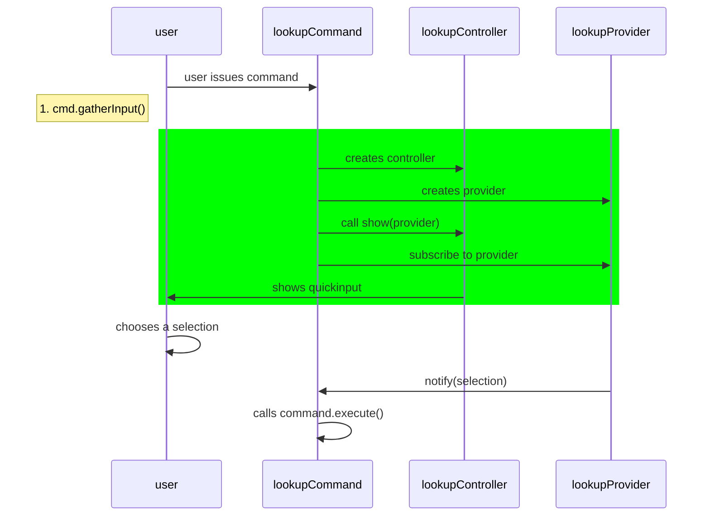

## Commands

### Create a new Command

1. Add command to `DENDRON_COMMANDS` under `plugin-core/src/constants.ts`
2. Open the command prompt, enter `Run Task`, and run `gen:config`
   - this will add the command to `package.json`
3. Create the new command in `plugin-core/src/commands/{COMMAND_NAME}.ts`
   - you can copy the contents of an existing command (eg. `src/commands/ShowHelp.ts`) to help you get started
4. Write tests
   - tests are in `plugin-core/src/test/suite-integ/{COMMAND}`
   - testing instructions are [[here|dendron.dev.qa]]
5. Write command logic
6. If it makes sense, add a keyboard shortcut for the command. Make sure it doesn't conflict with an generic VSCode command or existing Dendron commands. You can detect existing keybindings by using the guide [here](https://code.visualstudio.com/docs/getstarted/keybindings#_detecting-keybinding-conflicts)
7. Add command to `src/commands/index.ts`
8. Submit pull request

Conventions:

- if your command involves opening a note, also return it in the `CommandOutput` signature. this makes it easy to compose the command as well as test it

### Working with VSCode Workspace State

Use the [[State Service|pkg.plugin-core.arch.state-service]] when working with VSCode workspace related state.

## Lookup

### Add a new button

1. add type
   - src/commands/LookupCommand.ts
   ```ts
   export type LookupEffectType = "copyNoteLink" | "copyNoteRef" | "multiSelect" | "insertNote";
   ```
2. add button

```ts
export class InsertNoteLinkButton extends DendronBtn {
  static create(pressed?: boolean) {
    return new CopyNoteLinkButton({
      title: "Insert Note",
      iconOff: "diff-added",
      iconOn: "menu-selection",
      type: "insertNote" as LookupEffectType,
      pressed,
    });
  }

  async handle({ quickPick }: ButtonHandleOpts) {
    if (this.pressed) {
      let items: readonly DNodePropsQuickInputV2[];
      if (quickPick.canSelectMany) {
        items = quickPick.selectedItems;
      } else {
        items = quickPick.activeItems;
      }
      let links = items
        .filter((ent) => !PickerUtilsV2.isCreateNewNotePick(ent))
        .map((note) => NoteUtils.createWikiLink({ note }));
      if (_.isEmpty(links)) {
        vscode.window.showInformationMessage(`no items selected`);
      } else {
        await clipboard.writeText(links.join("\n"));
        vscode.window.showInformationMessage(`${links.length} links copied`);
      }
    }
  }
}
```

### Adding Command with Lookup

Pre-requisites:

- [[Create a new Command|pro.dendron-plugin.cook#create-a-new-command]]

This goes over adding a new command with lookup. To see an example, see this [command](https://github.com/dendronhq/dendron/blob/master/packages/plugin-core/src/commands/InsertNoteLink.ts) and this commit: `cc8a02b4`.



1 Gather inputs

- this method is responsible for configuring and instantiating the lookup controller and provider
  - controller controls presentation of the quickinput
  - provider controls the data retrieval behavior 
  - on success, will return the following [response type](https://github.com/dendronhq/dendron/blob/master/packages/plugin-core/src/components/lookup/LookupProviderV3.ts)
  - NOTE: because we can't simply block on `showQuickInput`, we return a promise that listens to a `lookupProvider` event with the corresponding `id` of the particular command

## UI

### Adding a Web UI Component

1. see [[Create a new Command|pro.dendron-plugin.cook#create-a-new-command]] for creating a new command
2. Add a new entry to [DendronWebViewKey](https://github.com/dendronhq/dendron/blob/master/packages/common-all/src/types/typesv2.ts)
3. in `execute`, create a new webview
   ```ts
     const title = //TODO: add panel title
     const panel = window.createWebviewPanel(
       "dendronIframe", // Identifies the type of the webview. Used internally
       title, // Title of the panel displayed to the user
       ViewColumn.One, // Editor column to show the new webview panel in.
       {
         enableScripts: true,
         enableCommandUris: true,
         enableFindWidget: true,
         localResourceRoots: [],
       }
     );
     resp = WebViewUtils.genHTMLForWebView({
         title: "Dendron Config",
         view: DendronWebViewKey[TODO]
     });
     panel.webview.html = resp;
   ```

Related:

- See [[here|pkg.dendron-next-server.dev#development]] for how to preview and test your web ui.

## Utilities

### Getting DendronEngine

```ts
getWS().engine
```

### Accessing DendronConfig

There are multiple ways to do this. You should get the config from the workspace instance. 

```ts
getWs().config
```

### Clipboard

```ts
import { clipboard } from "../utils";
clipboard.writeText(link);
```

### Check if file is in vault

- see src/views/DendronTreeViewV2.ts

```ts
  const uri = editor.document.uri;
  const basename = path.basename(uri.fsPath);
  const ws = getWS();
  if (!ws.workspaceService?.isPathInWorkspace(uri.fsPath)) {
    return;
  }
```

### Insert Text

- src/commands/InsertNoteCommand.ts

```ts
  const editor = VSCodeUtils.getActiveTextEditor()!;
  const pos = editor.selection.active;
  await editor.edit((builder) => {
    const selection = new Selection(pos, pos);
    builder.replace(selection, txt);
  });
```

### Prompt User for Input using Selection

- see [this](https://github.com/dendronhq/dendron/blob/master/packages/plugin-core/src/commands/VaultAddCommand.ts)

### Prompt User for Input using Free Text

- see [this](https://github.com/dendronhq/dendron/blob/master/packages/plugin-core/src/commands/VaultAddCommand.ts)

```ts
let out = await VSCodeUtils.showInputBox({
    prompt: "Path to your new vault (relative to your workspace root)",
    placeHolder: localVaultPathPlaceholder,
});
if (PickerUtilsV2.isStringInputEmpty(out)) return;
```

### Get location of the frontmatter

- example [here](https://github.com/dendronhq/dendron/blob/master/packages/plugin-core/src/services/NoteSyncService.ts)

```

```

## Tests

### Upating the cursor position

- see [this](https://github.com/dendronhq/dendron/blob/master/packages/plugin-core/src/test/suite-integ/NoteLookupCommand.test.ts)

