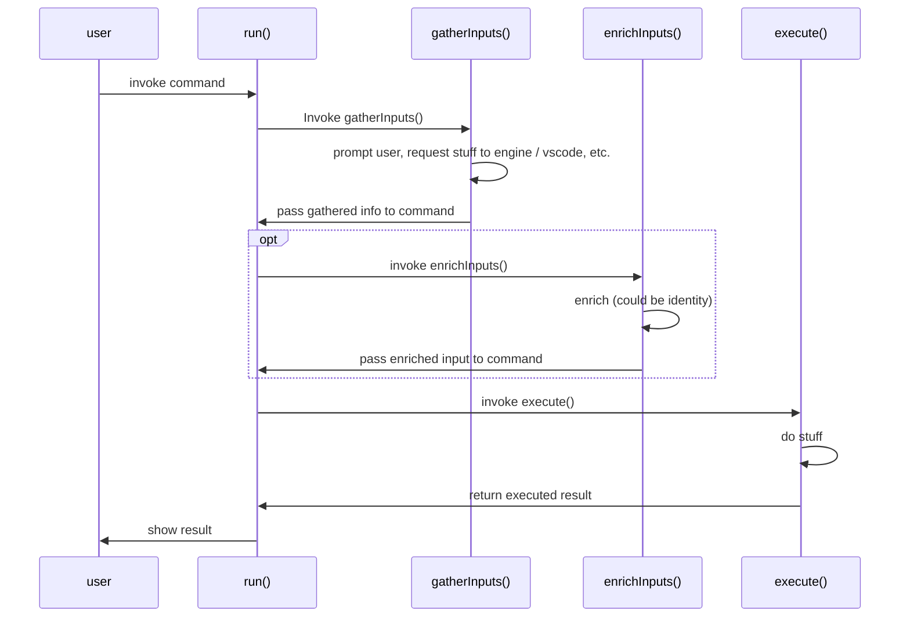
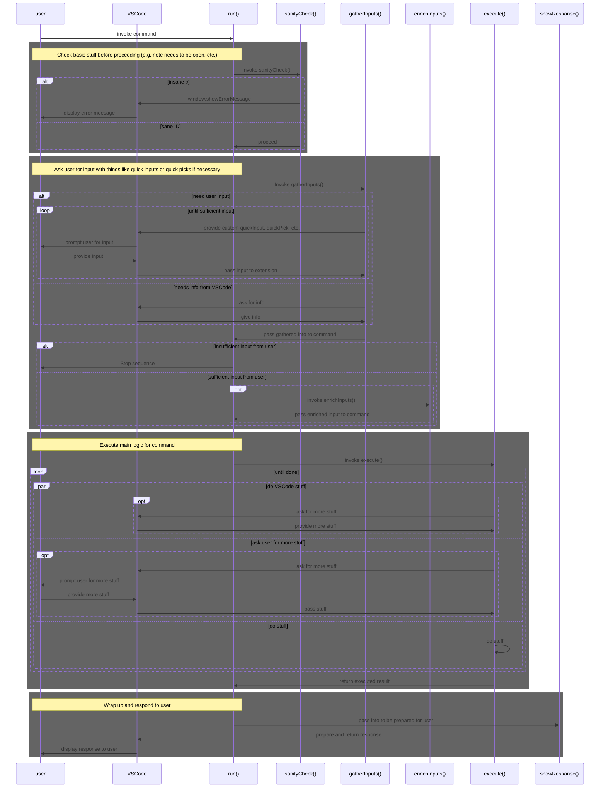

## Summary

VSCode command execution

## Base Command Lifecycle

### Simplified

This is a simplified sequence diagram of the `BaseCommand` lifecycle.
Note that the _optional_ flow between `run()` and `enrichInputs()` (marked with a dotted square with _opt_) is actually something that required to be implemented when you extend `BaseCommand` to make a new command. If the enrichment stage is not necessary, just make it an identity function (return input without doing anything).

### Detailed

This is a more detailed version of the above diagram. It includes more actors and flows that branch out of each step.

### Exceptions

When a command throws an exception that is not caught, it is caught by the parent. The parent will log the exception and show a message to the user. The error prompt will be what is in `error.message`.

## File Watchers
- [[Summary|pkg.plugin-core.internal.workspace-watcher#summary]]

### File Changes

File changes are watched by the following watchers:
	- [VaultWatcher](https://github.com/dendronhq/dendron/blob/master/packages/plugin-core/src/fileWatcher.ts#L65:L65).
	- [WorkspaceWatcher](https://github.com/dendronhq/dendron/blob/master/packages/plugin-core/src/WorkspaceWatcher.ts#L61:L61)
	- [WindowWatcher](https://github.com/dendronhq/dendron/blob/master/packages/plugin-core/src/windowWatcher.ts#L31:L31)

Hooks into `onDidChange`, `onDidCreate` and `onDidDelete` should be added here.

### WorkspaceWatcher

Modify files before saving them

Related:
- [[Workspace Watcher Internal|pkg.plugin-core.internal.workspace-watcher]]

#### onDidChangeTextDocument
- triggerUpdateDecorations

