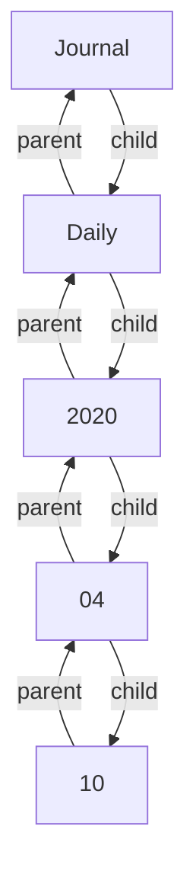

## Question

How is a Hierarchy represented in the Graph?

## Proposal

I would Propose that a Hierarchy level is a node in the Graph.
Turning a Hierarchy like `journal.daily.2020.04.10` into the following Graph:

The Graph is just an example visualization as a flowchart. As you see, each Level Links to its parent and children, creating a BiDirectional Graph in doing so.

## Additional Thoughts

But now we have Notes and Schemas that interact with the Hierarchy.

- A note sits in the Graph at the Hierarchy level.
  Could a note contain its Hierarchy through its headings?
  Extending the Hierarchy, it sits inside with the headings it contains.
  [[read more|rfc.7-graph-rework.notes]]
- A schema describes a hierarchy to validate it.
  [[read more|rfc.7-graph-rework.schemas]]

## Author

flammehawk:

- [@Github](https://github.com/flammehawk)
- @Discord fudo#1010
