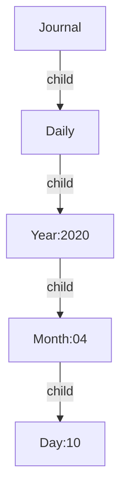

## Goal

Clarify what role schemas play in the Graph.

## Description

Currently, Schemas and the Notes are separated entities with two different structures.
In my eyes, a schema should be a Property of a Hierarchy Level.

As an example, we have the Schema **"Journal"**:

```yml
version: 1

schemas:
- id: journal
  title: Journal
  parent: root
  children:
    - daily    
- id: daily
  title: Daily
  children: 
    - year
- id: year
  title: "Year:${pattern}"
  pattern: "20[0-9][0-9]"
  children:
    - month
- id: month
  title: "Month:${pattern}"
  pattern: "[0-1][0-9]"
  children:
    - day
- id: day
  title: "Day:${pattern}"
  pattern: "[0-3][0-9]"
  namespace: true
```

This Schema would validate a particular Hierarchy pattern lets take the example from the [[Graph Rework - Hierarchy|rfc.7-graph-rework.hierarchy]] file to explain it.

We have the Hierarchy `journal.daily.2020.04.10` that would turn through this Schema into the following structure:

```yml
Journal:
  schema: journal
  children:
    - daily
Daily:
  schema: daily
  children: 
    - "2020"
"2020":
  schema: year
  value: 2020
  children: 
    - "04"
"04":
  schema: month
  value: 04
  children: 
    - "10"
"10":
  schema: day
  value: 04
  children: []
```

Which Schould turn into the following Graph:



## Further Thoughts

The Schemas should provide a way to use the Value that gets matched from the Pattern it gives, like in this case done for the title.

Further extensions of this could be to provide multiple patterns.
An example here could be the Month schema, to have a group of Schemas that act as one Hierarchy level Month but have different patterns and styles.

```yml
schemas: 
  - id: month
    title: "$element.title"
    type: group
    elements: 
       - January
       - February
       - "..."
       - "December"
  - id: january
    title: "January"
    patterns: 
       - "january"
       - "January"
       - "01"

```

Each month gets declared like January is in that Schema.
Having that possibility would be extending the possible use cases of Schemas in my Eyes.

## Author

flammehawk:

- [@Github](https://github.com/flammehawk)
- @Discord fudo#1010
